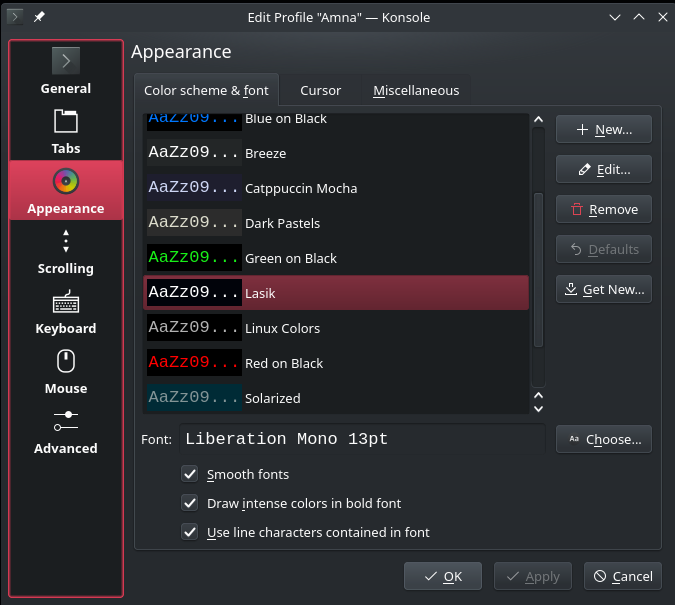
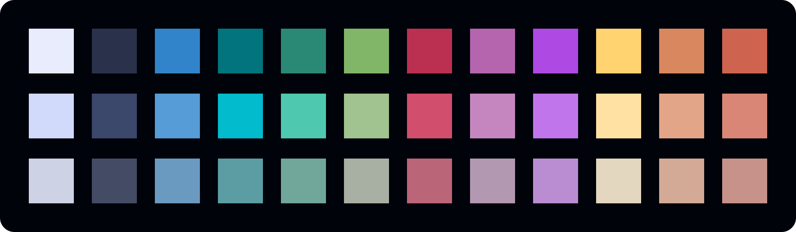
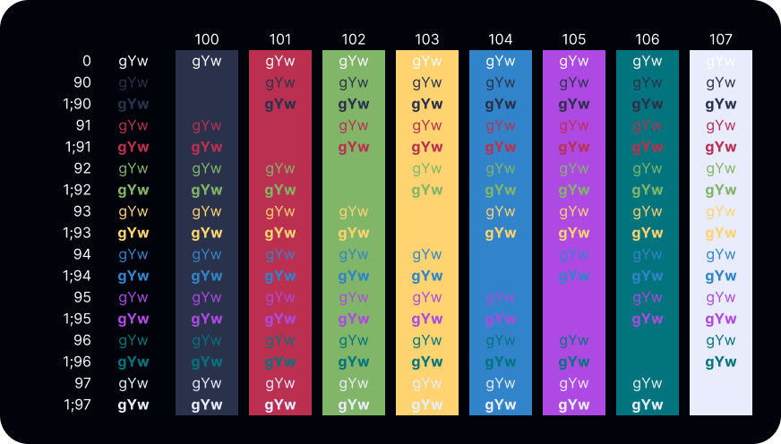

# Lasik

Lasik super dark theme palette for [Konsole](https://konsole.kde.org/)

[Figma file](https://www.figma.com/design/JVCY3qeWGMMbNTczHdBMaz/Lasik---VS-Code-theme?node-id=2017-1263&t=eIuGryfLXox4feHB-1)

See other Lasik versions

- [VS Code](https://marketplace.visualstudio.com/items?itemName=AmnaAkram.lasik)

## Installation

Themes for Konsole live under the `~/.local/share/konsole/` directory. Download the `Lasik.colorscheme` file to that folder and update Konsole profile to use that color scheme.

_Settings > Edit Current Profile... > Appearance > Color scheme & font > Lasik_

## Palette

